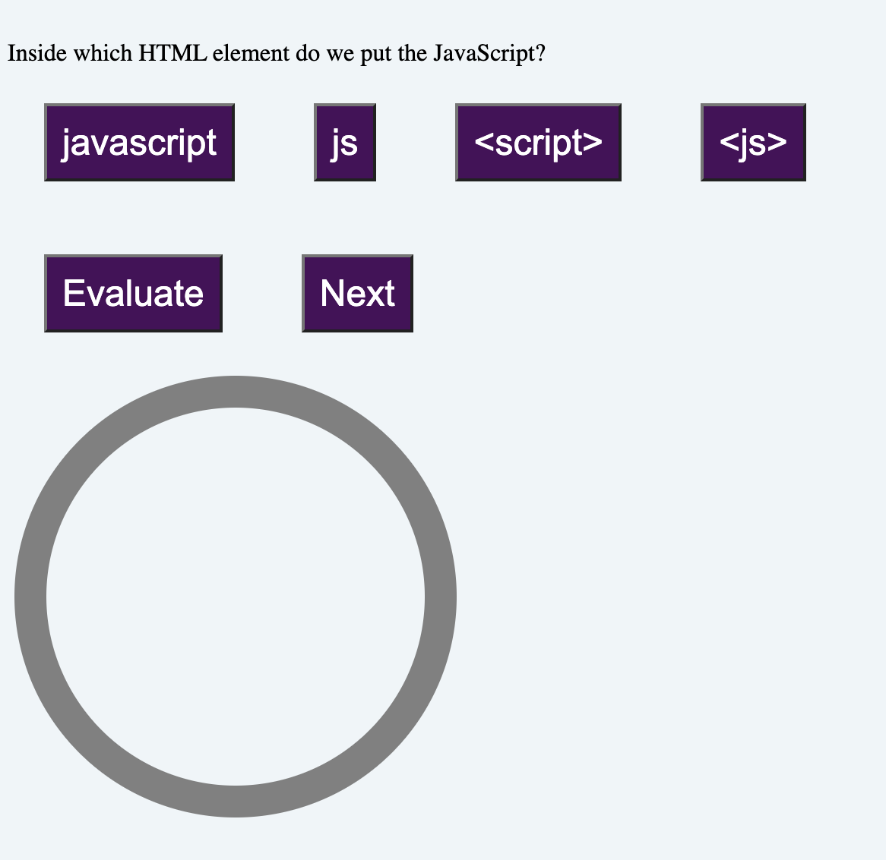

# CodeQuiz
README Items:
Installation
Usage
Credits
License

## Installation
Deploy the website and navigate through the website.

## Usage
The website can be deployed by clicking on the following link:
https://gladi023.github.io/CodeQuiz/

After deploying the website the user can attempt the quiz by reading the questions and choosing an answer as shown below:

## Credits
The original material that is included in the referenced websitres reviewed belongs to Trilogy Education Services.
Links for Online References used: 
1. https://www.w3schools.com/tags/att_script_src.asp
2. https://stackoverflow.com/questions/60037063/how-to-save-scores-in-javascript-quiz
3. https://www.geeksforgeeks.org/how-to-create-a-simple-javascript-quiz/
4. https://css-tricks.com/how-to-create-an-animated-countdown-timer-with-html-css-and-javascript/

## License
MIT License

Copyright (c) [2022] [Gladimar]

Permission is hereby granted, free of charge, to any person obtaining a copy
of this software and associated documentation files (the "Software"), to deal
in the Software without restriction, including without limitation the rights
to use, copy, modify, merge, publish, distribute, sublicense, and/or sell
copies of the Software, and to permit persons to whom the Software is
furnished to do so, subject to the following conditions:

The above copyright notice and this permission notice shall be included in all
copies or substantial portions of the Software.

THE SOFTWARE IS PROVIDED "AS IS", WITHOUT WARRANTY OF ANY KIND, EXPRESS OR
IMPLIED, INCLUDING BUT NOT LIMITED TO THE WARRANTIES OF MERCHANTABILITY,
FITNESS FOR A PARTICULAR PURPOSE AND NONINFRINGEMENT. IN NO EVENT SHALL THE
AUTHORS OR COPYRIGHT HOLDERS BE LIABLE FOR ANY CLAIM, DAMAGES OR OTHER
LIABILITY, WHETHER IN AN ACTION OF CONTRACT, TORT OR OTHERWISE, ARISING FROM,
OUT OF OR IN CONNECTION WITH THE SOFTWARE OR THE USE OR OTHER DEALINGS IN THE
SOFTWARE.